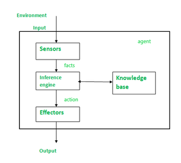

# Content
1. [Knowledge Representation](#knowledge-representation)
2. [Knowledge Based Agents](#knowledge-based-agents)
3. [Propositional Logic](#propositional-logic)
4. [First Order Predicate Logic](#first-order-predicate-logic)
5. [Forward Chaining](#forward-chaining)
6. [Backward Chaining](#backward-chaining)
7. [Forward vs Backward Chaining](#forward-vs-backward-chaining)
8. [Total Order Planning (TOP)](#total-order-planning-top)
9. [Partial Order Planning (POP)](#partial-order-planning-pop)
10. [Hierarchical Planning](#hierarchical-planning)
11. [Conditional Planning](#conditional-planning)

---

# Knowledge Representation
Knowledge representation is the method of organizing facts, rules, concepts, and relationships so an AI system can use them to solve problems and make decisions.

In Artificial Intelligence, knowledge representation is used so machines can behave intelligently instead of just blindly executing instructions.

### Knowledge Base
A knowledge base is a structured repository of knowledge that an AI system uses for reasoning and decision-making.

In Artificial Intelligence, the knowledge base acts like the “memory” of the system.

### Why it matters
AI systems need more than raw data.

Example:

- Data: "Paris"
- Useful knowledge: "Paris is the capital of France"

A machine must represent this information in a structured way to reason about it.

### Goals of Knowledge Representation

A good KR system should allow:

- Storing knowledge
- Retrieving knowledge
- Reasoning/inference
- Learning new information
- Decision-making

[Go To Top](#content)

---

# Knowledge Based Agents
A knowledge-based agent is a type of intelligent agent in Artificial Intelligence that uses stored knowledge about the world to make decisions and solve problems.

Instead of just reacting to inputs, it reasons using information it already knows.  

A knowledge-based agent works by:

1. Storing knowledge (facts, rules, relationships)
2. Updating knowledge when it gets new information
3. Using reasoning to decide what to do

### Main components
- **Knowledge Base (KB):**\
A collection of facts and rules about the world\
Example: “All humans are mortal”
- **Inference Engine:**\
The reasoning system that derives new information from known facts
Example: If “Socrates is a human,” then it concludes “Socrates is mortal”
- **Perception:**\
Gets input from the environment
- **Action:**\
Performs actions based on reasoning




### How it works (simple cycle)
1. Perceive something
2. Add it to the knowledge base
3. Infer new knowledge
4. Decide an action

### Example

A medical diagnosis system:

- Knowledge: Symptoms and diseases
- Input: Patient symptoms
- Reasoning: Matches symptoms to possible diseases
- Output: Diagnosis or advice


[Go To Top](#content)

---
# Propositional Logic
Propositional Logic is a branch of logic where statements are represented as propositions that are either:

- True (T) or
- False (F)

It is widely used in Artificial Intelligence, mathematics, and computer science for reasoning and decision-making.

### What is a Proposition?
A proposition is a statement that has a definite truth value.

Examples:

- “It is raining” → True/False
- “2 + 2 = 4” → True
- “Mumbai is in India” → True

Not propositions:

- “Close the door” (command)
- “How are you?” (question)

Because they don't have truth values.

### Logical Operators
| Operator      | Symbol | Meaning                                       | Example |
| ------------- | ------ | --------------------------------------------- | ------- |
| AND           | ∧      | True only if both statements are true         | P ∧ Q   |
| OR            | ∨      | True if at least one statement is true        | P ∨ Q   |
| NOT           | ¬      | Reverses the truth value                      | ¬P      |
| Implication   | →      | “If P then Q”                                 | P → Q   |
| Biconditional | ↔      | True if both statements have same truth value | P ↔ Q   |

**Example**
| P         | Q          | Expression | Meaning                                |
| --------- | ---------- | ---------- | -------------------------------------- |
| It rains  | It is cold | P ∧ Q      | It rains AND it is cold                |
| It rains  | It is cold | P ∨ Q      | It rains OR it is cold                 |
| It rains  | —          | ¬P         | It is NOT raining                      |
| I study   | I pass     | P → Q      | If I study, then I pass                | 
| Switch ON | Bulb glows | P ↔ Q      | Bulb glows if and only if switch is ON |

### Limitation
Propositional logic cannot express detailed relationships.

Example:

- “All humans are mortal”

This is difficult in propositional logic.\
For such cases, Predicate Logic is used.

[Go To Top](#content)

---
# First Order Predicate Logic
Predicate Logic is an extension of propositional logic that represents:

- objects
- properties
- relationships
- quantified statements

in a much more detailed and powerful way.

It is heavily used in Artificial Intelligence for knowledge representation and reasoning.

### Why Propositional Logic was not enough
Propositional logic treats entire statements as single units.

Example:
```
P = "Ram is human"
Q = "Ram is mortal"
```
The system cannot understand:

- who Ram is
- what “human” means
- relationships between objects

Predicate logic fixes this.

### Basic Components of Predicate Logic
1. Predicates

    Describe properties or relationships.

    Examples:
    ```
    Human(x)
    Loves(x, y)
    Kill(x, y)
    ```
    Meaning:

    - Human(x) → x is human
    - Loves(x,y) → x loves y
    - Kill(x,y) → x kills y
2. Variables

    Represent objects.

    Examples:
    ```
    x, y, z
    ```
3. Constants

    Specific objects/names.

    Examples:
    ```
    Ram, Sita, India
    ```
4. Quantifiers

    - Universal Quantifier (∀)

        Means “for all”.
        ```
        ∀x Human(x)→Mortal(x)
        ```
        Meaning:\
        All humans are mortal.

    - Existential Quantifier (∃)

        Means “there exists”.
        ```
        ∃x Student(x)∧Intelligent(x)
        ```
        Meaning:\
        There exists a student who is intelligent.
    
### Using inference:
If:

- Human(Ram)
- ∀x(Human(x) → Mortal(x))

Then:

- Mortal(Ram)

[Go To Top](#content)

---
# Forward Chaining
Forward chaining is a reasoning method where the system starts with known facts and keeps applying inference rules to derive new facts until it reaches a conclusion.

It’s called “forward” because reasoning moves from:

- data/facts → conclusions

rather than the reverse.

### Core Idea

You have:

- Knowledge Base (KB) → facts + rules
- Inference Engine → applies rules automatically

Example:

- Facts
    - `Human(Socrates)`
    - `Human(x)` → `Mortal(x)`
- Forward Propagation Process

    The system sees:

    - `Human(Socrates)` is true
    - Rule says: if someone is human, they are mortal
- So it derives:

    - `Mortal(Socrates)`

That new fact is then added back into the KB and may trigger more rules.

### Structure of Forward Propagation

Typically:

- Rule Form
    ```
    IF condition THEN conclusion
    ```
- or in logic:
    ```
    P → Q
    ```
    If `P` becomes true, infer `Q`.

### Example
Suppose the KB contains:
```
A
A → B
B → C
C → D
```
Forward propagation works like this:
- Step 1 - Known fact:
    ```
    A
    ```
 - Step 2 - Apply:
    ```
    A → B
    ```
    Infer:
    ```
    B
    ```
- Step 3 - Apply
    ```
    B → C
    ```
    infer
    ```
    C
    ```
- Step 4 - Apply
    ```
    C → D
    ```
    Infer
    ```
    D
    ```
- Final KB:
```
A, B, C, D
```

[Go To Top](#content)

---
# Backward chaining
Backward chaining is a reasoning method in knowledge representation and AI where the system starts with a goal/conclusion and works backward to determine whether the known facts can support it.

It is the opposite of forward chaining.

Direction:

- goal → required facts

instead of:

- facts → conclusions


### Example
Suppose the knowledge base contains:

- Rules
    ```
    A → B
    B → C
    C → D
    ```
- Facts
    ```
    A
    ```
- Now suppose we want to prove:
    ```
    D
    ```

#### Backward Chaining Process
- Goal:
    ```
    D
    ```
    The system searches for a rule that concludes `D`.
- Finds:
    ```
    C → D
    ```
    Now new subgoal becomes:
    ```
    C
    ```
- To prove `C`, find:
    ```
    B → C
    ```
    New subgoal:
    ```
    B
    ```
- To prove `B`, find:
    ```
    A → B
    ```
    New subgoal:
    ```
    A
    ```
- `A` is already a known fact.    

    So:

    - A true ⇒ B
    - B true ⇒ C
    - C true ⇒ D
- Therefore:
    ```
    D
    ```
    is proven.

### Why Backward Chaining Is Efficient
Backward chaining only explores rules relevant to the goal.

That makes it efficient when:

- you have many facts
- but only need one specific answer

[Go To Top](#content)

---
# Forward vs Backward Chaining
| Feature          | Forward Chaining                | Backward Chaining         |
| ---------------- | ------------------------------- | ------------------------- |
| Reasoning Type   | Data-driven                     | Goal-driven               |
| Starts From      | Facts                           | Goal                      |
| Direction        | Facts → Conclusion              | Goal → Facts              |
| Main Objective   | Derive all possible conclusions | Prove specific conclusion |
| Search Style     | Broad exploration               | Targeted exploration      |
| Efficiency       | Can waste computation           | Usually more efficient    |
| Best For         | Dynamic environments            | Specific queries          |
| Typical Use      | Monitoring systems              | Diagnostic systems        |
| Example Language | Production systems              | Prolog                    |


[Go To Top](#content)

---
# Total Order Planning (TOP)
Total Order Planning is an AI planning method where every action is arranged in one exact fixed sequence.

Example:
```
Step1 → Step2 → Step3 → Step4
```
The planner decides the complete execution order beforehand.

### Core Idea
In total order planning:

“At any moment, the next action is fully determined.”

### Simple Example
Goal:
```
Make tea
```
A total order planner may create:
```
1. Get cup
2. Boil water
3. Add tea bag
4. Pour water
```
Even if:
- some actions are independent

the planner still fixes their order.

### Key Characteristic

Every pair of actions has an ordering relation.

For example:
```
A before B
B before C
C before D
```
The entire plan becomes a single chain.

### Advantages of Total Order Planning
| Advantage                    | Why                        |
| ---------------------------- | -------------------------- |
| Simple execution             | Easy to follow             |
| Easy debugging               | Exact sequence known       |
| Lower management complexity  | Fewer constraints to track |
| Good for deterministic tasks | Stable environments        |


### Disadvantages
Suppose two tasks are independent:
```
Charge battery
Download updates
```
They could happen simultaneously.

But TOP may force:
```
Charge → Download
```
This:

- wastes time
- reduces flexibility
- limits parallel execution


[Go To Top](#content)

---
# Partial Order Planning (POP)
It’s a planning technique used in AI where actions are not forced into a strict sequence unless necessary.

Instead of deciding:
```
Step1 → Step2 → Step3
```
POP says:

“Only define ordering when one action truly depends on another.”

This creates a flexible plan.

### Core Idea
Traditional planning:

- fixes exact order of every action

Partial order planning:

- leaves independent actions unordered

because unnecessary ordering reduces flexibility.

### Example
Goal:
```
Make tea
```
Actions:

- Boil water
- Get cup
- Add tea bag
- Pour water

Necessary constraints:
```
Boil water before pouring
Tea bag before pouring
```
But:
```
Get cup
```
can happen anytime.

So POP avoids unnecessarily fixing its position.

### Why This Matters
Rigid planning causes problems.

Suppose robot planning says:
```
A → B → C → D
```
If B fails:

- whole chain may collapse

Partial ordering gives flexibility:

- independent tasks can still proceed

This is useful in:

- robotics
- scheduling
- automated agents
- workflow systems

### Important Property

POP is also called: “Least Commitment Planning”

Because it delays decisions until necessary.

That’s the real philosophy behind it.

Instead of prematurely fixing order,
it keeps options open.


### Structure of Partial Order Planning
A POP plan contains:

| Component            | Meaning                                    |
| -------------------- | ------------------------------------------ |
| Actions              | Tasks to perform                           |
| Ordering constraints | Required sequence rules                    |
| Causal links         | One action satisfies another’s requirement |
| Open preconditions   | Goals still unresolved                     |

### Key Concept: Causal Link
Suppose:
```
Boil Water → Pour Water
```
Why?

Because:

- “Pour Water” requires hot water
- “Boil Water” produces hot water

This dependency is called a causal link.

### Steps in Partial Order Planning

Typically:

1. Start with goal
2. Choose action satisfying goal
3. Add causal links
4. Add ordering constraints only when needed
5. Resolve conflicts/threats
6. Continue until all preconditions satisfied

### Real Weakness of POP
POP sounds elegant, but in practice:

- managing constraints becomes complex
- threat detection is expensive
- modern planners often use heuristic/state-space methods instead

So don’t assume POP dominates modern AI planning.

It’s foundational academically, but not always the most practical approach today.


[Go To Top](#content)

---
# Hierarchical Planning
Hierarchical Planning is an AI planning technique where a big complex goal is broken into smaller subgoals step-by-step.

Instead of planning everything at low level immediately, the system plans in layers.

### Core Idea
Think of it like this:
```
High-level goal
    ↓
Subtasks
    ↓
Smaller actions
    ↓
Executable steps
```
This is similar to how humans naturally solve problems.

You don’t think:

### Example

Goal:
```
Organize a birthday party
```
High-Level Tasks

1. Arrange venue
2. Arrange food
3. Invite people

Further Breakdown

- Arrange food\
    becomes:
    - Choose menu
    - Order food
    - Confirm delivery
- Invite people\
    becomes:
    - Create guest list
    - Send invitations

Eventually you reach executable actions.

### Terminology
| Term           | Meaning                     |
| -------------- | --------------------------- |
| Abstract task  | High-level goal             |
| Primitive task | Executable action           |
| Decomposition  | Breaking task into subtasks |

### Advantages
| Advantage                | Why                                      |
| ------------------------ | ---------------------------------------- |
| Handles complex problems | Breaks large tasks into manageable parts |
| More human-like          | Mirrors human reasoning                  |
| Efficient search         | Reduces planning complexity              |
| Reusable task structures | Common decompositions reused             |

### Weaknesses
Hierarchical planning depends heavily on:

- predefined decomposition knowledge
- handcrafted task structures

Meaning:

- someone usually needs to design the hierarchy.

So it’s less flexible in unknown environments.

[Go To Top](#content)

---
# Conditional Planning
Conditional Planning is an AI planning technique where the planner prepares different actions for different possible situations or outcomes.

Instead of making one fixed plan, it creates:
```
IF condition A → do X
ELSE → do Y
```
So the plan can adapt during execution.

### Core Idea
Normal planning assumes:

- environment behaves predictably

Conditional planning assumes:

- uncertainty exists
- outcomes may differ

Therefore the planner includes branches.

### Simple Example
Goal:
```
Go to college
```
Conditional plan:
```
IF raining:
    take umbrella

ELSE:
    go normally
```
The action depends on the condition.

### Why Conditional Planning Exists
Real-world environments are uncertain.

Things can fail:

- sensors may detect obstacles
- doors may be locked
- internet may disconnect
- traffic may occur

Rigid plans fail easily.

Conditional planning improves robustness.

### Structure of Conditional Plan
A conditional plan usually contains:
| Component    | Meaning                               |
| ------------ | ------------------------------------- |
| Actions      | Tasks performed                       |
| Conditions   | Situations checked                    |
| Branches     | Alternative paths                     |
| Observations | Information gathered during execution |

### Key Feature: Sensing
Conditional planning often requires:
- observing environment state

Example:
```
IF obstacle detected:
    turn left
ELSE:
    move forward
```
The system must sense whether obstacle exists.

### Major Advantage

Handles uncertainty better.

Instead of collapsing when something unexpected happens,
the system already has backup paths.

### Major Weakness

Plans become huge quickly.

Every uncertainty creates branches:
```
2 possibilities → 2 branches
10 possibilities → explosion
```
This is called: Combinatorial Explosion

One of the biggest problems in AI planning.


[Go To Top](#content)

---