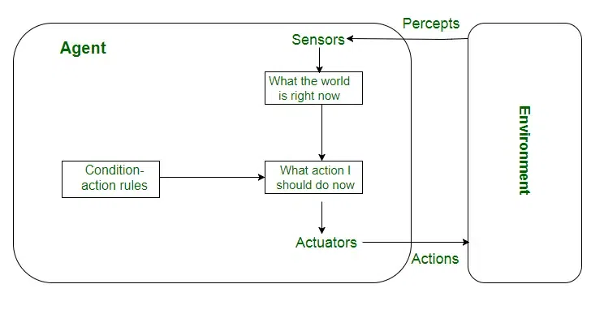
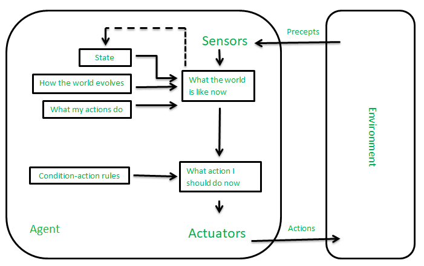
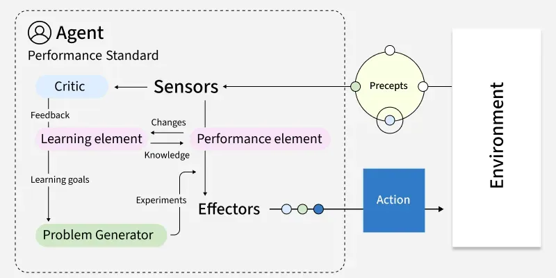

# Content
1. [Introduction to AI](#introduction-to-ai)
2. [Agents](#agents)
3. [Types of AI Agents](#types-of-ai-agents)

---

# Introduction to AI
Artificial Intelligence (AI) is a branch of Computer Science that focuses on creating machines or software capable of performing tasks that normally require human intelligence.

AI systems are designed to:

- Learn from data (like recognizing patterns)
- Understand language (chatbots, translation)
- Make decisions (recommendations, predictions)
- Solve problems (games, logistics, medical diagnosis)

### Applications of Artificial Intelligence (AI)
1. **Healthcare**
    - Disease detection (X-rays, MRI analysis)
    - Drug discovery (faster research)
    - Personalized treatment plans  

    **Example:** AI helps doctors detect diseases like cancer earlier and more accurately.
2. **Finance**
    - Fraud detection (real-time monitoring)
    - Algorithmic trading
    - Credit scoring  

    **Key Point:** AI detects suspicious transactions instantly, which is not possible manually.
3.  **E-commerce & Marketing**
    - Product recommendation systems
    - Customer behavior prediction
    - Dynamic pricing  

    **Example:** Platforms like Amazon and Flipkart suggest products based on your activity.
4. **Manufacturing**
    - Predictive maintenance
    - Quality control using computer vision
    - Industrial automation  

    **Key Point:** Reduces machine downtime and increases efficiency.
5. **Education**
    - Personalized learning platforms
    - AI tutors
    - Automated grading systems  

    **Example:** Systems adapt learning based on student performance.
6. **Cybersecurity**
    - Threat detection
    - Malware identification
    - Anomaly detection  

    **Key Point:** AI helps detect attacks before they cause damage.
7. **Agriculture**
    - Crop monitoring using drones
    - Yield prediction
    - Smart irrigation systems  

    **Example:** Farmers use AI to optimize resources and increase productivity.

[Go To Top](#content)

---

# Agents
An AI agent is an entity that perceives its environment, makes decisions, and takes actions to achieve a goal.

### Sensors and Actuators in AI Agents

These are the input and output parts of any agent.

**Sensor:**
- A sensor is anything that collects information from the environment.
- It tells the agent what’s happening.
- Examples:
    - Camera (captures images)
    - Microphone (captures sound)
    - Temperature sensor
    - GPS location data

**Actuator:**
- An actuator is anything that takes action based on decisions.
- It’s how the agent affects the environment.
- Examples:
    - Motors (move a robot)
    - Speakers (produce sound)
    - Display screen (show output)
    - Sending a notification

> Think like a human:
>- Sensors = eyes, ears, skin (input)
>- Actuators = hands, legs, mouth (output)

In AI Agent Terms
- Sensors → Perception
- Actuators → Action

Without sensors → agent is blind\
Without actuators → agent is useless

**Sensors gather data. Actuators execute decisions.**

### Example: Navigation Agent (like Google Maps)
**Goal:** get you from point A → point B as fast as possible

**Sensors (Input)**
- GPS location (where you are)
- Traffic data (live congestion)
- Road conditions (accidents, closures)

**Decision-Making**
- Calculates multiple routes
- Predicts travel time using past + real-time data
- Chooses the optimal path

**Actuators (Output)**
- Displays route on screen
- Gives voice directions
- Reroutes if traffic changes

**it is a real agent Because it continuously:**
- Observes (location + traffic)
- Decides (best route)
- Acts (guides you)
- Updates (reroutes if needed)

That loop is the key. Not a one-time response.

[Go To Top](#content)

---

# Types of AI Agents
These are the standard 5 types you’ll see in real systems.

### 1. Simple Reflex Agents
Act only on current input. No memory. No thinking ahead.

- Rule-based: if condition → action
- Works only in fully observable environments

Example:\
A basic thermostat (if temp > 25°C → turn AC on)

**Limitation**
- very less intelligent
- Fails in complex or changing environments

**Advantages**
- Very fast (no computation overhead)
- Easy to design and implement
- Works well in fully predictable environments

### 2. Model-Based Agents
Maintain an internal model (memory of the environnement).
- Keep track of past states
- Handle partially observable environments

Example:\
A robot that remembers obstacles it has already seen

**Limitations**
- Needs accurate internal model
- More complex to design
- Still doesn’t “plan” or optimize deeply

**Advantages**
- Handles partial observability
- Uses memory to track environment
- More flexible than reflex agents

### 3. Goal-Based Agents

Act to achieve a specific goal.

- Evaluate different possible actions
- Choose path that leads to goal

Example:\
Route planning in Google Maps

**Limitations**
- Computationally expensive (search/planning)
- Doesn’t consider how good a solution is—just reaches goal
- Slower than simpler agents

**Advantages**
- Works toward clear objectives
- Can evaluate multiple paths
- More intelligent decision-making
### 4. Utility-Based Agents

Don’t just achieve a goal—choose the best outcome.

- Use a utility function (score system)
- Optimize for efficiency, cost, time, etc.

Example:\
Choosing the fastest + cheapest route, not just any route

**Limitations**
- Designing a good utility function is hard
- High computation cost
- Can become overly complex

**Advantages**
- Chooses best possible outcome, not just any
- Handles trade-offs (time vs cost vs comfort)
- More realistic for real-world problems

### 5. Learning Agents

Improve performance over time using data.

- Learn from experience
- Adapt to new situations
- Most modern AI = this category

Example:\
Recommendation systems in YouTube or Netflix

**Limitations**
- Requires large amounts of data
- Training can be expensive (time + compute)
- Can make unpredictable or biased decisions
- Hard to debug

**Advantages**
- Improves over time
- Adapts to new environments
- Handles complex, dynamic problems

[Go To Top](#content)

---