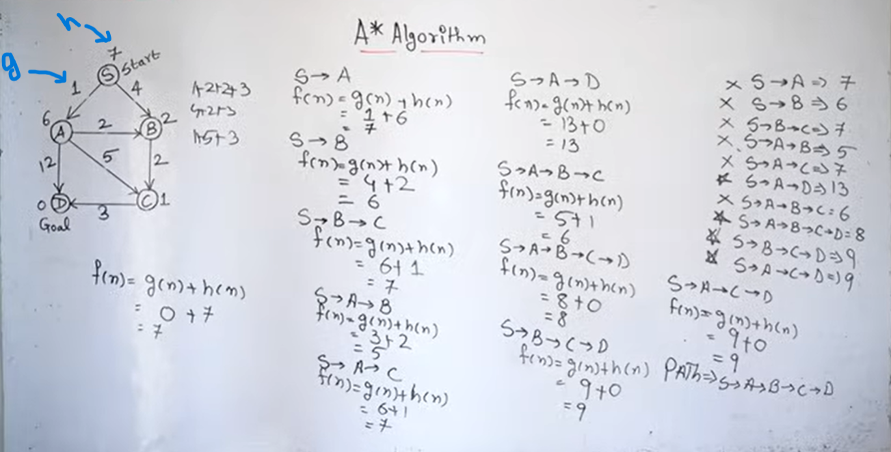

# Content
1.  [What is Searching?](#what-is-searching)
2. [Uninformed Search](#uninformed-search)
    - [Breadth First Search (BFS)](#1-breadth-first-search-bfs)
    - [Depth First Search (DFS)](#2-depth-first-search-dfs)
    - [Uniform Cost Search](#3-uniform-cost-search-ucs)
    - [Depth Limited Search ](#4-depth-limited-search-dls) 
    - [Iterative Deepening DFS](#5-iterative-deepening-dfs)
3. [Informed Search](#informed-search)
    - Greedy Algorithm
    - A* Algorithm
    - Best First Search
    - Hill Climbing
4. [Min Max Algorithm](#min-max-algorithm)

---
# What is Searching?

In AI, searching means finding a sequence of steps or actions to reach a goal from a starting point.

An AI system searches through different possible solutions to find the best or correct one.

In AI searching is used when:

- The solution is not directly known
- AI must explore possibilities

The AI checks different states and paths until it finds the goal.

### Why searching is important
Searching is the core of many AI systems because AI often needs to:

- Make decisions
- Find optimal solutions
- Plan actions

Without searching, many intelligent behaviors are impossible.


### Real-world examples
| Application      | What AI searches for |
| ---------------- | -------------------- |
| Google Maps      | Best route           |
| Chess AI         | Best move            |
| Robot navigation | Safe path            |
| Puzzle solving   | Correct solution     |

### Types of search in AI

1. **Uninformed Search**

    AI has no extra knowledge.

    Examples:

    - BFS (Breadth First Search)
    - DFS (Depth First Search)
2. **Informed Search**

    AI uses hints or heuristics.

    Example:

    - A* Algorithm

    Used for faster and smarter searching.


[Go To Top](#content)

---
# Uninformed Search
Uninformed Search (also called Blind Search) is a search technique in AI where the algorithm has no extra knowledge about which path is better.

It only knows:

- Initial state
- Goal state
- Possible actions

It does not know:

- Which direction is closer to the goal
- Which path is optimal beforehand

### Why called “uninformed”?

Because the algorithm has:

- No guidance   
- No estimate of goal distance
- No intelligence about better paths

It simply searches mechanically.

### Main types of uninformed search
| Algorithm                  | Working                            |
| -------------------------- | ---------------------------------- |
| [Breadth First Search (BFS)](#1-breadth-first-search-bfs) | Explores level by level            |
| [Depth First Search (DFS)](#2-depth-first-search-dfs)   | Goes deep first                    |
| [Uniform Cost Search](#3-uniform-cost-search-ucs)        | Chooses lowest-cost path           |
| [Depth Limited Search ](#4-depth-limited-search-dls)      | DFS with depth limit               |
| [Iterative Deepening DFS](#5-iterative-deepening-dfs)    | Repeated DFS with increasing depth |


[Go To Top](#content)

---


### 1. Breadth First Search (BFS)
Explores all nearby nodes first.

Example:
```
A
├── B
├── C
└── D
```
BFS checks:

- B, C, D first
- Then deeper levels

**Advantage**\
Finds shortest path (if costs are equal)

**Disadvantage**\
Uses lots of memory


[Go To Top](#content)

---


### 2. Depth First Search (DFS)
Goes as deep as possible before backtracking.

Example path:
```
A → B → E → H
```

**Advantage**\
Less memory usage

**Disadvantage**\
May get stuck in deep wrong paths


[Go To Top](#content)

---

### 3. Uniform Cost Search (UCS)
Uniform Cost Search (UCS) is an uninformed search algorithm that always expands the node with the lowest path cost first.

It is used when:

- Different paths have different costs
- We want the minimum-cost solution

#### Example

Suppose paths are:
```
A → B = cost 2
A → C = cost 5
B → D = cost 3
C → D = cost 1
```
Possible total costs to reach D:

- A → B → D = 5
- A → C → D = 6

UCS chooses:
```
A → B → D
```
because total cost is smaller.

#### Working of UCS
1. Start from initial node
2. Store nodes in priority queue
3. Expand node with smallest cumulative cost
4. Continue until goal found

#### Advantages
| Advantage                          | Meaning                            |
| ---------------------------------- | ---------------------------------- |
| Finds optimal solution             | Gives the minimum-cost path        |
| Complete                           | Will find solution if one exists   |
| Works with different costs         | Useful when path costs are unequal |
| Better than BFS for weighted paths | BFS ignores costs                  |

#### Limitations
| Limitation                       | Meaning                              |
| -------------------------------- | ------------------------------------ |
| Slow                             | Explores many nodes                  |
| High memory usage                | Stores many paths in memory          |
| Can be expensive computationally | More processing needed               |
| Not efficient for large spaces   | Performance decreases in huge graphs |


[Go To Top](#content)

---

### 4. Depth Limited Search (DLS)
Depth Limited Search (DLS) is a modified version of Depth First Search (DFS) where the search is allowed to go only up to a fixed depth limit.

> It prevents DFS from going infinitely deep.

Normal DFS:
- Keeps going deeper and deeper

Depth Limited Search:
- Stops after a certain level

#### Example

Suppose depth limit = 2
```
        A
      /   \
     B     C
    / \   / \
   D  E  F   G
  / \
 H   I
```

Levels:
- A → depth 0
- B,C → depth 1
- D,E,F,G → depth 2

If limit = 2:
- Search can only visit up to  D,E,F,G 
- Cannot go deeper, therefor can't visit H & I

#### Advantages
| Advantage                         | Meaning                          |
| --------------------------------- | -------------------------------- |
| Prevents infinite search          | Stops going endlessly deep       |
| Low memory usage                  | Uses memory like DFS             |
| Faster for limited-depth problems | Avoids exploring very deep nodes |
| Simple to implement               | Easy modification of DFS         |


#### Limitations

| Limitation                        | Meaning                          |
| --------------------------------- | -------------------------------- |
| May miss solution                 | If goal is deeper than limit     |
| Not optimal                       | Does not guarantee shortest path |
| Choosing depth limit is difficult | Wrong limit causes problems      |
| Incomplete sometimes              | Fails if solution beyond limit   |


[Go To Top](#content)

---

### 5. Iterative Deepening DFS

Iterative Deepening Depth First Search (IDDFS) is a search algorithm that combines:

- the low memory usage of DFS
- and the completeness of BFS

It repeatedly performs Depth Limited Search (DLS) with increasing depth limits.

Instead of searching infinitely deep like DFS, IDDFS does:

```
Depth limit = 0
Depth limit = 1
Depth limit = 2
...
# until the goal is found.
```

#### Example
```
        A
      /   \
     B     C
    / \
   D   E
``` 
Levels:
- A → depth 0
- B,C → depth 1
- D,E→ depth 2

Suppose goal = E

- **Iteration 1 (limit = 0)**

    Visit:
    ```
    A → depth 0
    ```
    Goal not found → increase limit.
- **Iteration 2 (limit = 1)**

    Visit:
    ```
        A        → depth 0
      /   \
     B     C     → depth 1
    ```
    Goal not found → increase limit.
- **Iteration 3 (limit = 2)**

    Visit:
    ```
         A        → depth 0
       /   \
      B     C     → depth 1
     / \
    D   E         → depth 2
    ```
    Goal found.

#### Advantages
| Advantage                     | Meaning                      |
| ----------------------------- | ---------------------------- |
| Complete                      | Finds solution if one exists |
| Low memory usage              | Uses memory like DFS         |
| Finds shortest path           | For equal path costs         |
| Avoids infinite depth problem | Uses depth limits            |
| Better than BFS in memory     | BFS stores many nodes        |

#### Limitations

| Limitation                    | Meaning                            |
| ----------------------------- | ---------------------------------- |
| Repeats searches              | Same nodes explored multiple times |
| Extra computation             | Repetition increases processing    |
| Slower than DFS sometimes     | Due to repeated iterations         |
| Not ideal for very deep goals | Many repeated depth expansions     |


[Go To Top](#content)

---
# Informed Search
Informed Search (also called Heuristic Search) is a search technique in AI where the algorithm uses extra knowledge or hints to find the goal faster.

Instead of searching blindly, it estimates: “Which path is more likely to reach the goal?”

### Heuristic Function

A heuristic is a rule or estimate that tells how close a state is to the goal.

Usually written as:

$$h(n)$$

Where:

- n = current node/state
- h(n) = estimated cost to reach goal

Lower heuristic value means:
- Closer to goal

#### Example
```
Node A → h(n)=10
Node B → h(n)=4
Node C → h(n)=2
```
AI prefers:
```
Node C
```
because it seems closest to goal.

### Characteristics

Informed search:
- Uses heuristics
- Faster than uninformed search
- Explores fewer nodes
- More efficient

But:
- Quality depends on heuristic accuracy

### Main types of informed search
| Algorithm                | Idea                         |
| ------------------------ | ---------------------------- |
| Greedy Best First Search | Chooses node closest to goal |
| A* Search                | Uses path cost + heuristic   |
| Best First Search | Chooses the most promising node using heuristic information |
| Hill Climbing | repeatedly moves toward the better neighboring state | 

### 1. Greedy Best First Search
Chooses the node with smallest heuristic value.

> Meaning: “Go where goal seems closest.”

**Problem**\
Can choose wrong shortcut sometimes.

### 2. A* Search
A* is an informed search algorithm used to find the shortest and optimal path between a start node and a goal node.

>Most important informed search algorithm.

Uses:

$$f(n) = g(n) + h(n)$$

Where:

- g(n) = actual cost from start
- h(n) = estimated cost to goal
- f(n) = total estimated cost



A* balances:

- path already traveled
- estimated distance left

Unlike:

- Greedy Search → only looks ahead
- UCS → only looks at past cost

A* uses both.
### 3. Best First Search
Best First Search is an informed search algorithm that selects the node that appears to be the closest or best toward the goal.

It uses a heuristic function to decide which node to explore next.


Working
- Start from initial node
- Evaluate heuristic value
- Choose node with smallest heuristic
- Continue until goal found

Usually implemented using a priority queue.


Example
```
A
├── B (h=4)
├── C (h=2)
└── D (h=6)
```
Best First Search chooses:
```
C
```
because it has smallest heuristic value.

#### 4. Hill Climbing
Hill Climbing is an informed search algorithm used for optimization problems.

It continuously moves toward the better state by choosing the neighboring state with the highest improvement.

Working of Hill Climbing
1. Start from current state
2. Check neighboring states
3. Move to the best neighbor
4. Repeat until no improvement possible

Example:\
Suppose AI wants to maximize a score:
```
Current state value = 5
Neighbors = 7, 9, 6
```
Choose:
```
9
```
because it is the best neighboring state.

#### Types of Hill Climbing
| Type                          | Meaning                         |
| ----------------------------- | ------------------------------- |
| Simple Hill Climbing          | Chooses first better neighbor   |
| Steepest-Ascent Hill Climbing | Chooses best neighbor among all |
| Stochastic Hill Climbing      | Chooses random better neighbor  |


[Go To Top](#content)

---
# Min Max Algorithm
Minimax is a search algorithm that searches through a space of possible future states to find the optimal one.

Minimax algorithm is also a decision-making algorithm used in two-player turn-based games where:

- One player tries to maximize the score.
- The other tries to minimize it.
- Both players are assumed to play perfectly.

Typical use cases:

- Chess
- Tic-Tac-Toe
- Checkers
- Connect Four

### Core Idea

You simulate all possible future moves.

- MAX player chooses the move with the highest score
- MIN player chooses the move with the lowest score

The algorithm recursively explores the game tree.

### Game Tree
Example structure:
```
                MAX
             /    |    \
           MIN   MIN   MIN
          /  \   / \   /  \
         3   5  2  9  12  5
```
**Step 1 — MIN layer**\
MIN chooses smallest values:

```
MIN(3,5) = 3
MIN(2,9) = 2
MIN(12,5) = 5
```
Now tree becomes:
```
                MAX
             /    |    \
            3     2     5
```
**Step 2 — MAX layer**\
MAX chooses largest:
```
MAX(3,2,5) = 5
```
**Final answer:**\
→ choose the branch leading to 5

### Alpha-Beta Pruning
Alpha-Beta Pruning is an optimization technique for the Minimax algorithm that eliminates branches which cannot possibly affect the final decision.

> Stop searching moves that are already proven useless.

#### Intuition
```
                MAX
              /     \
            MIN      MIN
           /  \      /  \
          3    5    2    ?
```
- Left MIN subtree

    ```
    min(3,5)=3
    ```

- Explore Right MIN

    First child:
    ```
    2
    ```
    As this subtree will return the lowest value and the value of first child is `2`, then final value to be return will ne `2` or less than `2`
    ```
    min(2, x) = 2  -> 2 is lowest
    min(2, x) = x  -> x < 2
    ```
    As parent node is MAX node which will accept the max value and we also know that left subtree is returning the `3` which is greater than `2`
    
    Therefor even if we explore the `x` and return, it won't get selected as `x < 2` always

    Hence we ignore `x` to save the resources, the is what we called pruning


[Go To Top](#content)

---
